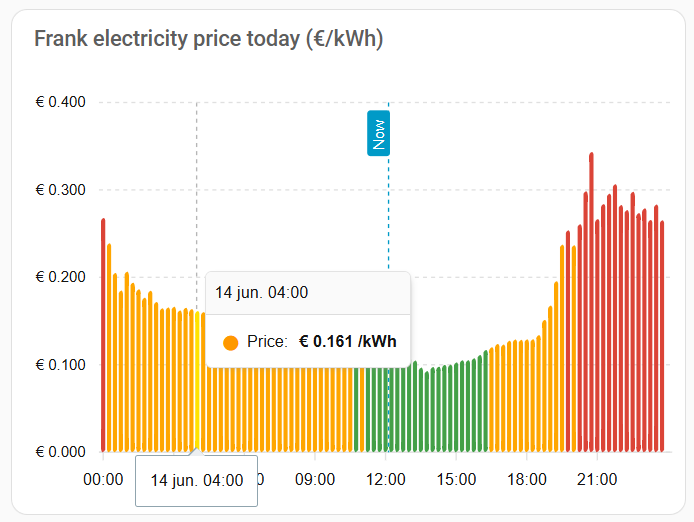

# Frank Energie Kwartierprijzen voor Home Assistant (Custom Component)

[](https://github.com/hacs/integration)
[](https://github.com/Bennie-JC/ha-frank-quarter-prices/releases/latest)
[](https://github.com/Bennie-JC/ha-frank-quarter-prices/releases/latest)
[](https://github.com/Bennie-JC/ha-frank-quarter-prices/stargazers)
[](https://github.com/Bennie-JC/ha-frank-quarter-prices/issues)
[](https://github.com/Bennie-JC/ha-frank-quarter-prices/commits/main)
[](LICENSE)
[](https://www.home-assistant.io/)
[](https://github.com/Bennie-JC/ha-frank-quarter-prices)

Een Home Assistant **custom component** die de **dynamische marktprijzen voor stroom van Frank Energie** ontsluit — inclusief **kwartierprijzen (15 minuten)** resolutie — als een compacte set sensoren, ontworpen als een zuivere **prijsbron voor een energiemanagementsysteem (EMS)**.

> Deze integratie haalt elke 15 minuten de openbare Frank Energie GraphQL API op en levert de prijzen van vandaag en morgen, de huidige prijs en het goedkoopste en duurste prijsvenster van elke dag. De volledige prijsreeksen zijn beschikbaar als sensorattributen voor je eigen EMS-logica, batterijsturing en dynamische energietarieven.

---

## Inhoudsopgave

- [Functies](#functies)
- [Installatie](#installatie)
  - [HACS-installatie (aanbevolen)](#hacs-installatie-aanbevolen)
  - [Handmatige installatie](#handmatige-installatie)
- [Configuratie](#configuratie)
- [Aangemaakte sensoren](#aangemaakte-sensoren)
  - [Sensoroverzicht](#sensoroverzicht)
  - [Sensoren goedkoopste / duurste prijsvenster](#sensoren-goedkoopste--duurste-prijsvenster)
  - [Attributen van prijsblokken](#attributen-van-prijsblokken)
- [Home Assistant Energy Dashboard](#home-assistant-energy-dashboard)
  - [Netafname (verbruik)](#netafname-verbruik)
  - [Teruglevering aan het net](#teruglevering-aan-het-net)
  - [Rekenvoorbeeld terugleverprijs](#rekenvoorbeeld-terugleverprijs)
- [Verwerking van prijzen voor morgen](#verwerking-van-prijzen-voor-morgen)
- [GraphQL API-bron](#graphql-api-bron)
- [ApexCharts-dashboard](#apexcharts-dashboard)
- [EMS-integratievoorbeelden](#ems-integratievoorbeelden)
- [Voorbeeld Home Assistant-templates](#voorbeeld-home-assistant-templates)
- [Merkmateriaal (integratie-icoon)](#merkmateriaal-integratie-icoon)
- [Probleemoplossing](#probleemoplossing)
- [Veelgestelde vragen](#veelgestelde-vragen)
- [Bijdragen](#bijdragen)
- [Disclaimer](#disclaimer)
- [Licentie](#licentie)

---

## Functies

- ⚡ **Kwartierprijzen** — volledige marktprijsresolutie van 15 minuten (met automatische terugval naar 60-minutendata wanneer dat is wat Frank Energie publiceert).
- 📅 **Vandaag & morgen** — beide dagen worden automatisch opgehaald; de prijzen voor morgen verschijnen zodra ze gepubliceerd zijn (doorgaans rond 15:00 CET).
- 💶 **Sensor voor de huidige prijs** — het actieve prijsblok, met de volledige prijsopbouw als attributen.
- 📉 Sensoren voor het **goedkoopste en duurste** prijsvenster (prijs + starttijd) voor de **volledige dag**, zowel vandaag als morgen.
- 🗂️ **Volledige prijsreeksen** voor vandaag en morgen als sensorattributen — ideaal als databron voor een EMS.
- 🔁 **Robuuste updates** — als de data voor morgen nog niet beschikbaar is, breekt dit de integratie nooit; de sensoren blijven simpelweg onbeschikbaar tot publicatie.
- 🌍 **NL als standaard met optionele BE-ondersteuning** via de `x-country`-header.
- 🛠️ **Diagnostiek-ondersteuning** voor eenvoudige probleemoplossing (geheimen worden weggelaten).
- 🧩 Gebouwd op Home Assistant's `DataUpdateCoordinator` en config entries, volgens de moderne best practices (2025+).

---

## Installatie

### HACS-installatie (aanbevolen)

1. Zorg dat [HACS](https://hacs.xyz/) geïnstalleerd is.
2. Ga in Home Assistant naar **HACS → Integraties → ⋮ (rechtsboven) → Aangepaste repositories**.
3. Voeg de repository-URL toe:
   ```
   https://github.com/Bennie-JC/ha-frank-quarter-prices
   ```
   en kies de categorie **Integratie**.
4. Zoek naar **Frank Quarter Prices** in HACS en klik op **Downloaden**.
5. **Herstart Home Assistant**.

### Handmatige installatie

1. Download de nieuwste release van de [releases-pagina](https://github.com/Bennie-JC/ha-frank-quarter-prices/releases).
2. Kopieer de map `custom_components/frank_quarter_prices` naar de map `config/custom_components/` van je Home Assistant:
   ```
   config/
   └── custom_components/
       └── frank_quarter_prices/
           ├── __init__.py
           ├── manifest.json
           ├── ...
   ```
3. **Herstart Home Assistant**.

---

## Configuratie

De configuratie verloopt volledig via de gebruikersinterface (config flow).

1. Ga naar **Instellingen → Apparaten & Services → Integratie toevoegen**.
2. Zoek naar **Frank Quarter Prices**.
3. Volg de stappen en bevestig.

Alle entiteiten worden gegroepeerd onder één **Frank**-apparaat, zodat entiteit-ID's de korte vorm `sensor.frank_<naam>` aannemen (bijvoorbeeld `sensor.frank_current_price`). De voorbeelden in deze README gebruiken die ID's direct — je kunt ze controleren via **Ontwikkelaarshulpmiddelen → Statussen** op je eigen systeem.

---

## Aangemaakte sensoren

De integratie maakt exact **13 entiteiten** aan, afgestemd op gebruik binnen een EMS.

Voor elke dag vraagt de integratie **alle** prijsblokken voor stroom op bij Frank Energie (lokaal 00:00 → 24:00) en bepaalt het enige goedkoopste en het enige duurste blok van die **volledige dag**, op de ruwe resolutie die Frank teruggeeft (15 minuten of per uur). Er wordt geen filtering op de komende 24/48 uur, geen filtering op alleen de huidige tijd, geen filtering op alleen de toekomst en geen uurgemiddelde toegepast.

### Sensoroverzicht

| Entiteit | Beschrijving | Status | Eenheid |
| --- | --- | --- | --- |
| `sensor.frank_current_price` | Prijs van het op dit moment actieve blok | `total_price_eur_kwh` | EUR/kWh |
| `sensor.frank_current_return_price` | Geschatte actuele terugleverprijs voor stroom, op basis van het geverifieerde Frank-marktprijsveld en de ingestelde teruglevercorrectie | berekende prijs | EUR/kWh |
| `sensor.frank_cheapest_today` | Goedkoopste blokprijs van de volledige dag vandaag | `total_price_eur_kwh` | EUR/kWh |
| `sensor.frank_cheapest_time_today` | Starttijd van het goedkoopste blok vandaag | `HH:MM` | — |
| `sensor.frank_most_expensive_today` | Duurste blokprijs van de volledige dag vandaag | `total_price_eur_kwh` | EUR/kWh |
| `sensor.frank_most_expensive_time_today` | Starttijd van het duurste blok vandaag | `HH:MM` | — |
| `sensor.frank_cheapest_tomorrow` | Goedkoopste blokprijs van de volledige dag morgen | `total_price_eur_kwh` | EUR/kWh |
| `sensor.frank_cheapest_time_tomorrow` | Starttijd van het goedkoopste blok morgen | `HH:MM` | — |
| `sensor.frank_most_expensive_tomorrow` | Duurste blokprijs van de volledige dag morgen | `total_price_eur_kwh` | EUR/kWh |
| `sensor.frank_most_expensive_time_tomorrow` | Starttijd van het duurste blok morgen | `HH:MM` | — |
| `sensor.frank_prices_today` | Aantal prijsblokken vandaag (volledige reeks in attributen) | aantal | blokken |
| `sensor.frank_prices_tomorrow` | Aantal prijsblokken morgen (volledige reeks in attributen) | aantal | blokken |
| `binary_sensor.frank_tomorrow_prices_available` | Of de prijzen voor morgen gepubliceerd zijn | aan/uit | — |

### Sensoren goedkoopste / duurste prijsvenster

Voor elke dag is er een bij elkaar horend paar sensoren, opgebouwd uit hetzelfde blok:

**Prijssensor** (`sensor.frank_cheapest_today`, `sensor.frank_most_expensive_today` en de `*_tomorrow`-varianten):

- **Status:** de `total_price_eur_kwh` van het blok (EUR/kWh).
- **Attributen:**
  - `time` — de lokale **start**tijd van het blok als `"HH:MM"` (bijv. `"19:45"`),
  - `timestamp` — de start van het blok als lokale ISO-datumtijd,
  - `end_timestamp` — het einde van het blok als lokale ISO-datumtijd,
  - `duration_minutes` — de bloklengte (15 of 60),
  - `full_block` — de volledige prijsopbouw.

**Tijdsensor** (`sensor.frank_cheapest_time_today`, `sensor.frank_most_expensive_time_today` en de `*_tomorrow`-varianten):

- **Status:** de lokale **start**tijd van het blok als `"HH:MM"` (bijv. `"13:45"`).
- **Attributen:** `price`, `timestamp`, `end_timestamp`, `duration_minutes`, `full_block`.

Voorbeeld:

```text
sensor.frank_cheapest_today = 0.0735           # EUR/kWh
  attributes:
    time: "19:45"
    timestamp: "2026-06-13T19:45:00+02:00"
    end_timestamp: "2026-06-13T20:00:00+02:00"
    duration_minutes: 15

sensor.frank_cheapest_time_today = "19:45"
  attributes:
    price: 0.0735
    timestamp: "2026-06-13T19:45:00+02:00"
    end_timestamp: "2026-06-13T20:00:00+02:00"
    duration_minutes: 15
```

De `*_tomorrow`-sensoren blijven **onbeschikbaar** totdat Frank Energie de prijzen voor morgen publiceert.

### Attributen van prijsblokken

Het attribuut `full_block` (en elk item in de `prices`-reeksen) heeft de volgende vorm:

```yaml
from: "2026-06-13T14:00:00+02:00"
till: "2026-06-13T14:15:00+02:00"
duration_minutes: 15
market_price: 0.08123
market_price_tax: 0.01705
sourcing_markup_price: 0.01700
energy_tax_price: 0.10154
total_price_eur_kwh: 0.21682
per_unit: "kWh"
```

De sensoren `sensor.frank_prices_today` en `sensor.frank_prices_tomorrow` stellen de **volledige reeks** prijsblokken voor de hele dag beschikbaar in hun `prices`-attribuut, samen met `resolution_minutes`, `cheapest_block`, `most_expensive_block`, `average_price`, `min_price` en `max_price`. Daarmee zijn ze de handige enkele bron waartegen een EMS kan plannen.

---

## Home Assistant Energy Dashboard

Vanaf versie `0.1.3` zijn de actuele-prijssensoren geschikt voor het **Home Assistant Energy Dashboard**. Zo koppel je de **dynamische stroomprijs** van Frank Energie — onderdeel van je **dynamische energieprijzen** — aan zowel je netafname als je teruglevering. Je stelt dit in via **Instellingen → Dashboards → Energie** bij je elektriciteitsnet-configuratie.

**Snel overzicht — welke entiteit hoort waar:**

```text
Kosten bijhouden:
Gebruik een entiteit met de actuele prijs
→ Current price
→ sensor.frank_current_price

Vergoeding exporteren:
Een entiteit met actuele vergoeding gebruiken
→ Current feed-in price
→ sensor.frank_current_return_price
```

> **Let op — niet verwisselen:**
> - `sensor.frank_current_price` is de **actuele stroomprijs** voor stroom die je **van het net afneemt** (import).
> - `sensor.frank_current_return_price` is de **actuele terugleververgoeding** voor stroom die je **aan het net teruglevert** (export).
> - Selecteer `sensor.frank_current_price` **niet** als de vergoeding voor teruglevering.
> - Selecteer `sensor.frank_current_return_price` **niet** als de afnameprijs.

### Netafname (verbruik)

Dit is de **actuele stroomprijs** voor stroom die je **van het net afneemt**. In de configuratie van je elektriciteitsnet, onder **Kosten bijhouden**, kies je:

```text
Gebruik een entiteit met de actuele prijs
```

Selecteer vervolgens de entiteit die wordt weergegeven als **Current price**:

```text
sensor.frank_current_price
```

Deze sensor wordt gebruikt voor de **kosten van stroom die je van het net afneemt** en bevat de actuele afnameprijs (`total_price_eur_kwh`) als numerieke waarde in **EUR/kWh**, met de juiste metadata (`device_class: monetary`), zodat het Home Assistant Energy Dashboard hem als prijsentiteit accepteert. Er wordt bewust geen `state_class` ingesteld: dit is een actuele prijs, geen cumulatief totaal.

### Teruglevering aan het net

Dit is de **actuele terugleververgoeding** voor stroom die je **aan het net teruglevert**. In dezelfde configuratie, onder **Vergoeding exporteren**, kies je:

```text
Een entiteit met actuele vergoeding gebruiken
```

Selecteer vervolgens de entiteit die wordt weergegeven als **Current feed-in price**:

```text
sensor.frank_current_return_price
```

Deze sensor wordt gebruikt voor de **vergoeding van stroom die je aan het net teruglevert** en bevat de geschatte actuele **terugleverprijs** als numerieke waarde in **EUR/kWh**.

Belangrijk om te weten:

- Deze sensor is een **schatting**, tenzij de Frank API een expliciet terugleverprijsveld aanbiedt. Op de openbare API is dat op dit moment **niet** het geval, dus de waarde wordt berekend uit het geverifieerde marktprijsveld plus je ingestelde teruglevercorrectie.
- Contractvoorwaarden kunnen verschillen — controleer de waarde altijd aan de hand van je eigen Frank Energie-contract.
- De teruglevercorrectie mag **positief** (extra vergoeding), **negatief** (inhouding of terugleverkosten) of **nul** zijn.
- De sensor past **geen** energiebelasting en **geen** saldering (net metering) toe.
- De berekening staat los van het aflopen van de Nederlandse salderingsregeling op 1 januari 2027.

De teruglevercorrectie en de btw-optie wijzig je via:

```text
Instellingen → Apparaten & Services → Frank Quarter Prices → Configureren
```

Het optievenster bevat twee instellingen:

```text
Teruglevercorrectie
21% btw toepassen op terugleverprijs
```

De standaard teruglevercorrectie is `0.0 EUR/kWh` en de btw-optie staat standaard **uit**, zodat bestaande installaties zonder herconfiguratie exact dezelfde waarde blijven tonen.

De sensor stelt daarnaast een paar stabiele attributen beschikbaar:

```yaml
market_price_source: market_price      # het gebruikte, geverifieerde prijsveld
market_price: 0.08000                  # de ruwe marktprijs van het actieve blok
feed_in_adjustment: 0.0                # de ingestelde teruglevercorrectie
calculation_method: market_price_plus_adjustment
```

### Rekenvoorbeeld terugleverprijs

De terugleverprijs wordt berekend op basis van de btw-optie.

**Checkbox uit (standaard):**

```text
terugleverprijs = marktprijs + teruglevercorrectie
```

**Checkbox aan:**

```text
terugleverprijs = (marktprijs + teruglevercorrectie) × 1,21
```

De btw wordt dus toegepast op de volledige vergoeding: de marktprijs plus de ingestelde teruglevercorrectie.

Voorbeeld met een positieve correctie (btw uit):

```text
Geverifieerde marktprijs: 0.080 EUR/kWh
Ingestelde correctie:     0.018 EUR/kWh
Geschatte terugleverprijs: 0.098 EUR/kWh
```

Voorbeeld met een negatieve correctie:

```text
Geverifieerde marktprijs: 0.080 EUR/kWh
Ingestelde correctie:    -0.017 EUR/kWh
Geschatte terugleverprijs: 0.063 EUR/kWh
```

De juiste correctie hangt af van je eigen contract. Beide voorbeelden zijn slechts illustratief en vertegenwoordigen **niet** het actuele Frank Energie-contract. Een negatieve terugleverprijs is mogelijk en wordt niet afgekapt naar nul.

Voorbeeld met **21% btw toepassen op terugleverprijs** ingeschakeld:

```text
Geverifieerde marktprijs: 0.00323 EUR/kWh
Ingestelde correctie:     0.01820 EUR/kWh
Geschatte terugleverprijs: (0.00323 + 0.01820) × 1,21 = 0.0259303 EUR/kWh
```

Over de btw-optie:

- De optie staat **standaard uitgeschakeld**; laat je hem uit, dan blijft de berekening exact zoals hierboven zonder btw.
- **Controleer zelf** in je eigen Frank Energie-contract of afrekening of jouw terugleververgoeding inclusief of exclusief btw wordt berekend — jij blijft verantwoordelijk voor de keuze die bij jouw situatie past.
- Het in- of uitschakelen is **niet** gekoppeld aan het kalenderjaar. De integratie zet de btw **niet** automatisch aan in 2026 of uit in 2027.
- Btw-behandeling en de salderingsregeling zijn **losstaande** zaken. Het aflopen van de saldering bepaalt niet automatisch of er btw van toepassing is.

> **Over het gebruikte prijsveld:** de openbare `marketPrices`-query levert `marketPrice`, `marketPriceTax`, `sourcingMarkupPrice` en `energyTaxPrice`. Verificatie tegen de live API wees uit dat `marketPriceTax` exact 21% btw over `marketPrice` is (een kostenpost aan de *afname*kant) en dat er geen expliciet terugleverveld bestaat. Daarom gebruikt de integratie bewust alleen de ruwe `marketPrice` (zonder btw, energiebelasting of inkoopopslag) als basis voor de terugleverprijs.

---

## Verwerking van prijzen voor morgen

Frank Energie publiceert de prijzen van de volgende dag in de loop van de middag (doorgaans rond **15:00 CET**). De integratie gaat hier soepel mee om:

- De prijzen voor morgen worden bij **elke update** (elke 15 minuten) **altijd geprobeerd**.
- Als ze **nog niet beschikbaar** zijn, dan:
  - houdt de integratie `binary_sensor.frank_tomorrow_prices_available` **uit**,
  - laat ze de `*_tomorrow`-sensoren **onbeschikbaar**,
  - logt ze enkel een **info**-melding — er wordt nooit een `UpdateFailed` opgeworpen en de integratie wordt niet als mislukt gemarkeerd alleen omdat morgen ontbreekt.
- Zodra ze gepubliceerd zijn (doorgaans na **15:00 lokale tijd**), gaat `binary_sensor.frank_tomorrow_prices_available` **aan** en vullen de sensoren voor morgen zich bij de volgende verversing van 15 minuten.

Gebruik de binaire sensor om automatiseringen die afhankelijk zijn van de prijzen van morgen pas te laten starten zodra die beschikbaar zijn.

---

## GraphQL API-bron

De prijzen worden opgehaald uit de openbare Frank Energie GraphQL API:

```
https://graphql.frankenergie.nl/
```

Voor marktprijzen is geen authenticatie vereist. De integratie voert een query uit die lijkt op:

```graphql
query MarketPrices($date: String!, $resolution: PriceResolution!) {
  marketPrices(date: $date, resolution: $resolution) {
    electricityPrices {
      from
      till
      resolution
      marketPrice
      marketPriceTax
      sourcingMarkupPrice
      energyTaxPrice
      perUnit
    }
  }
}
```

De integratie vraagt `resolution: PT15M` op, wat **native kwartierprijzen (96 blokken per dag)** teruggeeft — zonder authenticatie. De blokken worden exact gebruikt zoals ze worden teruggegeven en worden nooit samengevoegd.

> **Belangrijk:** het argument `resolution: PriceResolution!` ontsluit de kwartierdata. Zonder dit argument (of met `PT60M`) geeft dezelfde `marketPrices`-query slechts **24 uurblokken** terug, en dat is de reden waarom het goedkoopste blok eerder bijvoorbeeld naar `14:00` sprong in plaats van `13:45`. De query `marketPricesElectricity(startDate, endDate)` geeft eveneens alleen uurdata terug en wordt niet gebruikt.

Verzoeken gebruiken een time-out van 30 seconden en worden tot 3 keer opnieuw geprobeerd. Ongeldige records worden gevalideerd en overgeslagen. België (BE) wordt ondersteund door de header `x-country: BE` mee te sturen; Nederland (NL) is de standaard.

---

## ApexCharts-dashboard

Je kunt de prijzen visualiseren als een kleurgecodeerde staafdiagram — **één staaf per prijsblok**. Wanneer Frank Energie native kwartierdata teruggeeft, krijg je **96 staven per dag**; als alleen uurdata beschikbaar is, krijg je **24 staven**. De data wordt nooit samengevoegd.



### Benodigde frontend-kaarten (HACS)

Installeer beide via **HACS → Frontend**:

- **ApexCharts Card** — `RomRider/apexcharts-card`
- **Config Template Card** — `iantrich/config-template-card`

Herlaad na de installatie je browser (of leeg de frontend-cache) zodat de nieuwe kaarttypes beschikbaar zijn.

### Hoe het werkt

- De grafiek leest het attribuut **`prices`** van `sensor.frank_prices_today` (of `sensor.frank_prices_tomorrow`).
- Elk item in `attributes.prices` wordt afzonderlijk weergegeven aan de hand van het **`from`**-tijdstempel (x-as) en de **`total_price_eur_kwh`**-waarde (y-as).
- Omdat elke staaf zijn eigen tijdstempel heeft, worden kwartierblokken precies op `00:00`, `00:15`, `00:30`, … geplot zoals teruggegeven — zonder afronding naar het uur.
- De drie **kleurdrempels** (groen → oranje → rood) kun je handmatig aanpassen in de YAML, of laten aansturen door optionele `input_number`-helpers (`sensor.frank_green_threshold` / `sensor.frank_red_threshold`); de voorbeelden vallen terug op `0.12` en `0.25 €/kWh` wanneer die helpers niet bestaan.

Kant-en-klare bestanden vind je in [examples/](examples/):

- [examples/apexcharts_frank_prices_today.yaml](examples/apexcharts_frank_prices_today.yaml)
- [examples/apexcharts_frank_prices_tomorrow.yaml](examples/apexcharts_frank_prices_tomorrow.yaml)

### Grafiek voor vandaag

Voeg een nieuwe **Handmatige** dashboardkaart toe en plak:

```yaml
type: custom:config-template-card
variables:
  GREEN: "states['sensor.frank_green_threshold'] ? states['sensor.frank_green_threshold'].state : 0.12"
  RED: "states['sensor.frank_red_threshold'] ? states['sensor.frank_red_threshold'].state : 0.25"
entities:
  - sensor.frank_prices_today
card:
  type: custom:apexcharts-card
  graph_span: 24h
  span:
    start: day
  now:
    show: true
    label: Now
  experimental:
    color_threshold: true
  header:
    show: true
    title: Frank electricity price today (€/kWh)
  apex_config:
    chart:
      height: 320
    legend:
      show: false
    yaxis:
      min: 0
      decimalsInFloat: 3
      labels:
        formatter: |
          EVAL:function(val){ return "€ " + val.toFixed(3); }
    tooltip:
      x:
        format: dd MMM HH:mm
      "y":
        formatter: |
          EVAL:function(val){ return "€ " + val.toFixed(3) + " /kWh"; }
    dataLabels:
      enabled: false
    plotOptions:
      bar:
        columnWidth: 70%
        borderRadius: 2
  series:
    - entity: sensor.frank_prices_today
      name: Price
      type: column
      stroke_width: 0
      float_precision: 5
      color_threshold:
        - value: 0
          color: "#43a047"
        - value: ${Number(GREEN)}
          color: "#ffa600"
        - value: ${Number(RED)}
          color: "#db4437"
      data_generator: |
        return (entity.attributes.prices || [])
          .filter(r => r && r.from && r.total_price_eur_kwh !== null && r.total_price_eur_kwh !== undefined)
          .map(r => {
            const p = Number(String(r.total_price_eur_kwh).replace(',', '.'));
            return [new Date(r.from), isNaN(p) ? null : p];
          });
```

### Grafiek voor morgen

Dezelfde stijl, maar leest `sensor.frank_prices_tomorrow`. De kaart blijft leeg totdat Frank Energie de prijzen voor morgen publiceert (≈15:00 CET).

> **Opmerking over de span:** `apexcharts-card` heeft geen betrouwbare "tomorrow"-span-offset. De grafiek vertrouwt op de `data_generator`, die echte tijdstempels uit `attributes.prices` uitstuurt, zodat elke staaf op zijn correcte absolute tijd wordt geplot, ongeacht het ingestelde venster. `span.offset: +24h` is toegevoegd als hint; als jouw versie van de kaart dit negeert, worden de staven nog steeds op de juiste tijden weergegeven omdat elk punt zijn eigen `from`-datumtijd draagt.

```yaml
type: custom:config-template-card
variables:
  GREEN: "states['sensor.frank_green_threshold'] ? states['sensor.frank_green_threshold'].state : 0.12"
  RED: "states['sensor.frank_red_threshold'] ? states['sensor.frank_red_threshold'].state : 0.25"
entities:
  - sensor.frank_prices_tomorrow
card:
  type: custom:apexcharts-card
  graph_span: 24h
  span:
    start: day
    offset: +24h
  now:
    show: true
    label: Now
  experimental:
    color_threshold: true
  header:
    show: true
    title: Frank electricity price tomorrow (€/kWh)
  apex_config:
    chart:
      height: 320
    legend:
      show: false
    yaxis:
      min: 0
      decimalsInFloat: 3
      labels:
        formatter: |
          EVAL:function(val){ return "€ " + val.toFixed(3); }
    tooltip:
      x:
        format: dd MMM HH:mm
      "y":
        formatter: |
          EVAL:function(val){ return "€ " + val.toFixed(3) + " /kWh"; }
    dataLabels:
      enabled: false
    plotOptions:
      bar:
        columnWidth: 70%
        borderRadius: 2
  series:
    - entity: sensor.frank_prices_tomorrow
      name: Price
      type: column
      stroke_width: 0
      float_precision: 5
      color_threshold:
        - value: 0
          color: "#43a047"
        - value: ${Number(GREEN)}
          color: "#ffa600"
        - value: ${Number(RED)}
          color: "#db4437"
      data_generator: |
        return (entity.attributes.prices || [])
          .filter(r => r && r.from && r.total_price_eur_kwh !== null && r.total_price_eur_kwh !== undefined)
          .map(r => {
            const p = Number(String(r.total_price_eur_kwh).replace(',', '.'));
            return [new Date(r.from), isNaN(p) ? null : p];
          });
```

---

## EMS-integratievoorbeelden

Gebruik het goedkoopste en duurste prijsvenster om een energiemanagementsysteem (EMS), laden of zware apparaten aan te sturen — denk aan **batterij laden op goedkope stroom**, **batterij ontladen op dure stroom** en **energie-arbitrage**. Elke goedkoopste/duurste sensor stelt de attributen `timestamp` en `end_timestamp` beschikbaar (lokale ISO-datumtijden) die handig zijn voor het inplannen.

**Laad een elektrische auto tijdens het goedkoopste blok vandaag:**

```yaml
automation:
  - alias: "Charge EV at cheapest price today"
    trigger:
      - platform: template
        value_template: >
          {{ now() >= state_attr('sensor.frank_cheapest_today', 'timestamp') | as_datetime
             and now() < state_attr('sensor.frank_cheapest_today', 'end_timestamp') | as_datetime }}
    action:
      - service: switch.turn_on
        target:
          entity_id: switch.ev_charger
```

**Voorkom dat de vaatwasser draait tijdens de dagelijkse piek:**

```yaml
automation:
  - alias: "Block dishwasher during peak price"
    trigger:
      - platform: template
        value_template: >
          {{ now() >= state_attr('sensor.frank_most_expensive_today', 'timestamp') | as_datetime
             and now() < state_attr('sensor.frank_most_expensive_today', 'end_timestamp') | as_datetime }}
    action:
      - service: switch.turn_off
        target:
          entity_id: switch.dishwasher
```

**Reageer alleen wanneer de prijs laag genoeg is (drempelwaarde):**

```yaml
automation:
  - alias: "Heat water when price is low"
    trigger:
      - platform: state
        entity_id: sensor.frank_current_price
    condition:
      - condition: numeric_state
        entity_id: sensor.frank_current_price
        below: 0.15
    action:
      - service: switch.turn_on
        target:
          entity_id: switch.water_heater
```

---

## Voorbeeld Home Assistant-templates

**Toon de huidige prijs netjes opgemaakt:**

```yaml
{{ states('sensor.frank_current_price') | float(0) | round(4) }} €/kWh
```

**Tijd tot het goedkoopste blok vandaag:**

```yaml


  {{ (start - now()).total_seconds() // 60 }} minutes

  unknown

```

**Is de huidige prijs lager dan het gemiddelde van vandaag?**

```yaml


  {{ states('sensor.frank_current_price') | float(0) < avg }}

  unknown

```

**Goedkoopste prijs morgen (wacht tot gepubliceerd):**

```yaml

  {{ states('sensor.frank_cheapest_tomorrow') }} €/kWh

  Tomorrow's prices not published yet

```

---

## Merkmateriaal (integratie-icoon)

Deze integratie wordt geleverd met neutraal, zelfgemaakt icoon- en logomateriaal (een bliksemschicht voor een kwartierklok, in een wolkblauwe stijl). De **kant-en-klare PNG-bestanden** staan onder [custom_components/frank_quarter_prices/brand/](custom_components/frank_quarter_prices/brand/):

- `icon.png` — 256×256
- `icon@2x.png` — 512×512
- `logo.png` — 256×256
- `logo@2x.png` — 512×512

De bewerkbare bronbestanden (SVG) staan onder [custom_components/frank_quarter_prices/icons/](custom_components/frank_quarter_prices/icons/) (`icon.svg`, `logo.svg`). Al dit materiaal gebruikt bewust **niet** het officiële Frank Energie-logo of enig handelsmerk.

### Het icoon verschijnt overal (Home Assistant 2026.3+)

Sinds **Home Assistant 2026.3** laden custom integraties hun eigen merkmateriaal rechtstreeks uit een lokale `brand/`-map binnen de integratie — er is **geen** PR naar de [home-assistant/brands](https://github.com/home-assistant/brands) repository meer nodig. Lokale merkafbeeldingen krijgen zelfs **voorrang** op de centrale Brands-repository. Deze integratie bevat die map al ([custom_components/frank_quarter_prices/brand/](custom_components/frank_quarter_prices/brand/)), dus het icoon verschijnt automatisch overal — zowel op de integratiekaart als in de **integratielijst**.

> **Zie je nog *"icon not available"*?** Herstart Home Assistant (of herlaad de integratie) en leeg eventueel de browsercache. De afbeeldingen worden geserveerd via `/api/brands/integration/frank_quarter_prices/icon.png`. Op Home Assistant-versies ouder dan 2026.3 toont de lijst een generieke tijdelijke afbeelding totdat je upgradet; dit is puur cosmetisch en heeft geen invloed op de werking.

> **Bijdragen aan Home Assistant Core?** Alleen als deze integratie ooit in HA core wordt opgenomen, moeten de lokale `brand/`-bestanden worden verwijderd en in plaats daarvan via een PR aan de [home-assistant/brands](https://github.com/home-assistant/brands) repository worden toegevoegd (map `custom_integrations/frank_quarter_prices/`).

---

## Probleemoplossing

- **Entiteiten tonen `unavailable`:**
  - Voor de sensoren voor morgen / goedkoopste-morgen is dit verwacht voordat Frank Energie de volgende dag publiceert (rond 15:00 CET). Controleer `binary_sensor.frank_tomorrow_prices_available`.
  - Voor alle sensoren: controleer of de integratie geladen is onder **Instellingen → Apparaten & Services**.
- **Entiteit-ID's komen niet overeen met de README:** zie de opmerking bij [Configuratie](#configuratie) — pas ze aan naar de ID's die getoond worden in **Ontwikkelaarshulpmiddelen → Statussen**.
- **Helemaal geen data:** controleer of Home Assistant uitgaande internettoegang heeft tot `https://graphql.frankenergie.nl/`.
- **Schakel debug-logging in** door dit toe te voegen aan `configuration.yaml` en te herstarten:

  ```yaml
  logger:
    default: warning
    logs:
      custom_components.frank_quarter_prices: debug
  ```

- **Diagnostiek:** open de apparaatpagina → **⋮ → Diagnostiek downloaden** en voeg het (van geheimen ontdane) bestand toe aan elke bugmelding.

---

## Veelgestelde vragen

**Heb ik een Frank Energie-account of API-token nodig?**
Nee. Marktprijzen zijn openbaar en vereisen geen authenticatie.

**Toont dit mijn persoonlijke contract- of verbruikskosten?**
Nee. Het toont de componenten van de marktprijs (marktprijs, belasting, inkoopopslag, energiebelasting). Je werkelijke tarief kan afwijken afhankelijk van je contract.

**Welke resolutie hebben de prijzen?**
Native kwartierprijzen (15 minuten, **96 blokken per dag**) — de integratie vraagt `resolution: PT15M` op via de openbare `marketPrices`-query. Heeft Frank Energie voor een bepaalde dag geen kwartierdata, dan wordt in plaats daarvan uurdata teruggegeven (60 minuten, 24 blokken). De blokken worden exact gebruikt zoals teruggegeven en worden nooit samengevoegd, zodat de goedkoopste/duurste tijden de exacte kwartierstart weergeven (bijv. `13:45`).

**Hoe vaak wordt het bijgewerkt?**
Elke 15 minuten via een `DataUpdateCoordinator`.

**Waarom is morgen 's ochtends leeg?**
Frank Energie publiceert de prijzen van de volgende dag doorgaans in de middag (~15:00 CET). De `*_tomorrow`-sensoren blijven tot dan onbeschikbaar en de integratie geeft in de tussentijd nooit een fout.

**Ondersteunt het België?**
Ja — Nederland (NL) is de standaard; Belgische (BE) prijzen worden opgevraagd via de `x-country`-header.

**Is dit een officiële Frank Energie-integratie?**
Nee, dit is een onafhankelijk communityproject. Zie de [disclaimer](#disclaimer).

---

## Bijdragen

Bijdragen zijn welkom! Open gerust een [issue](https://github.com/Bennie-JC/ha-frank-quarter-prices/issues) of dien een pull request in. Open voor grotere wijzigingen eerst een issue om te bespreken wat je zou willen veranderen.

---

## Disclaimer

Dit project is **niet gelieerd aan, onderschreven door of ondersteund door Frank Energie**. Het maakt gebruik van een openbaar toegankelijke API en wordt geleverd "as is", zonder enige garantie. Getoonde prijzen kunnen afwijken van je werkelijke contractprijzen. Gebruik op eigen risico.

---

## Licentie

Gedistribueerd onder de voorwaarden van het [LICENSE](LICENSE)-bestand in deze repository.
